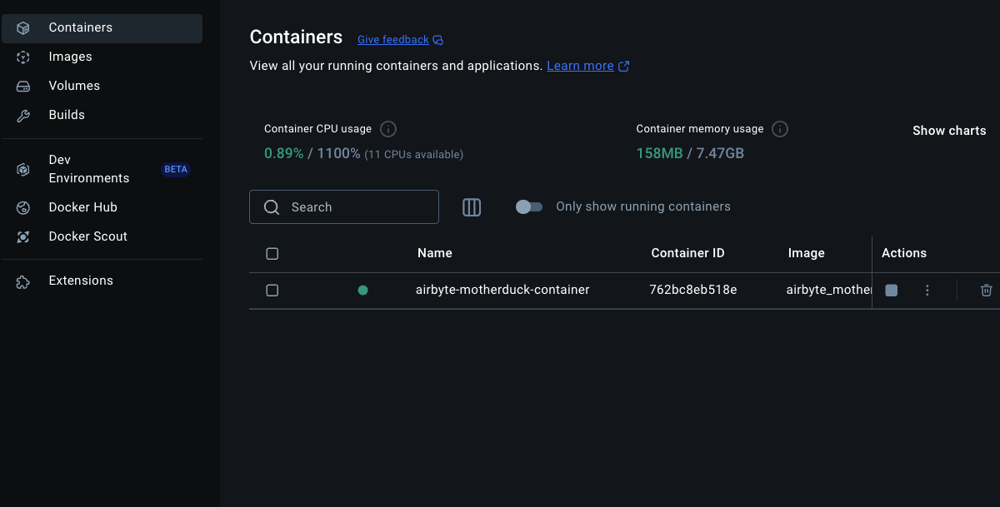

# Data-Driven Customer Support: Transforming the Customer supoport experience at 'Ocelot Living'

Ocelot Living is a brand that sells top home electronics to customers both online and in-store.

Recently, we discovered that a significant portion of customer support time is spent addressing repetitive queries that are already explained in the user manuals of our products. This not only overwhelms our Customer support team but also delays resolutions for more complex issues, impacting customer satisfaction.

In this hackathon, we aim to address this challenge by leveraging data and AI to create a scalable solution. Our mission is to enhance customer support efficiency while empowering customers to independently troubleshoot and resolve common issues.

## The Solution: `👷🏽‍♀️ Anuja`

We developed Anuja, a data-driven AI customer support chatbot designed to assist customers in resolving issues quickly and independently. By parsing product user manuals into actionable data, Anuja provides instant and accurate troubleshooting solutions. This allows our support team to focus on high-priority issues, improving overall service quality and customer experience.

(Note: for this hackathon we limited the scope to only Dishwashers, but this can be extended to other applainces as well)

### Data Architecture


#### 1. Data sources

The Data sources are:

- An Airtable CRM made containing the records of appliances purchased by customers at Appliance Ocelot
  

- An S3 bucket that conatins semi-structured data of the parsed output (JSON) of PDFs of User manuals.

This parsed JSON data was parsed using the python pacakge PYMuPDF, as well as Google Gemini to enable us scan relevant sections of the user manuals that hold information related to common truobleshooting and maintenance issues.

#### 2. Data Ingestion

Airbyte was used as our ingestion platform to ingest the different sections of the PDF user manuals which were saved as JSON data in s3, this data was then loaded into a table called `manual_sections` in MotherDuck our Data warehouse.

Airbyte was also used to ingest the different tables (structured) of data created in our Airtable base.

#### 3. Data Warehouse

The parsed JSON data from the User manuals stored were stored in a table called `manual_sections`. This table provided more context to our chabot by giving it the relevant sections where particular information, such as trobleshooting, error codes in the user manuals. Airtable's tables ingested in Airbyte empower our chatbot by allowing us to filter down to the particular User manual that contain the information based off on the User's purchase. This streamlining helps us etract only the relevant information that can be used in answering the user's questions or solving the user's issues.

#### 4. Google Gemini

Google Gemini was our chosen solution choice for our LLM because of it's relatively easy cost as well as it's ability of `structured output` capability. We chose `gemini-2.0-flash-exp` version because of its notable speed and performance.
We used Google Gemini to empower our chatbot by providing it with a prompt + context (which was gotten from the parsed User manuals)

# Setting Up

## Requirements

This project requires the following software installed:

- [Terraform](!https://developer.hashicorp.com/terraform/install) (for provisioning resources)
- [Docker desktop](!https://docs.docker.com/get-started/get-docker/) (for running the web app)

### Accounts

You will also need access to an [**Airbyte cloud account**](https://airbyte.com/product/airbyte-cloud), [**AWS account**](https://aws.amazon.com/), an [**Airtable account**](https://airtable.com), and [**Google Gemini**](https://gemini.google.com/) account

### Airtable

For Airtable, [here](https://airtable.com/app9prJZjrqpUAnZt/shrbOzAfiZVwzwO9D) is the CRM table that was used for this project. You can copy this base to your own airtable account workspace.

### Environmental variables

To set up Terraform and to successfully build the Docker image for this project you will need to fill in the values for the following credentials found in the [test.env](test.env) and in [iac/dev.tfvars](iac/dev.tfvars) files in the project's directory:

You can access your Airbyte `AIRBYTE_CLIENT_SECRET` and `AIRBYTE_CLIENT_ID` by following the steps included in this [link](!https://reference.airbyte.com/reference/authentication).

For your Google Gemini API key, you can sign up for Google Gemini, and access your `GEMINI_API_KEY` by following the steps [here](https://aistudio.google.com/apikey)

For your AWS keys, see this [link](!https://repost.aws/knowledge-center/create-access-key)

To get your Motherduck API key follow the steps [here](https://motherduck.com/docs/key-tasks/authenticating-and-connecting-to-motherduck/authenticating-to-motherduck/#authentication-using-an-access-token)

> [test.env](test.env)

```bash
# Fill in your keys here
GEMINI_API_KEY= #Your Google GEMINI API key
BUCKET_NAME= #Your S3 Bucket name
DB_NAME=my_db
AIRTABLE_API_KEY= #Your Airtable access token
ENVIRONMENT=AWS #Default is AWS or it can be LOCAL
AIRTABLE_BASE_ID= #The Airtable Base id
AIRTABLE_CUSTOMER_ACCOUNTS_TABLE_ID= #The Airtable Customer accounts table id
AIRTABLE_PRODUCT_TABLE_ID= #Your Airtable Product table id
AIRBYTE_WORKSPACE_ID= #Your Airtable workspace ID
AWS_ACCESS_KEY_ID= #Your AWS Access Key
AWS_SECRET_ACCESS_KEY= #Your AWS Secret Access Key
AIRBYTE_CLIENT_ID= # Your Airbyte application client ID
AIRBYTE_CLIENT_SECRET= # Your Airbyte application client secret
MOTHERDUCK_API_KEY= #Your Motherduck API key
```

> [iac/dev.tfvars](iac/dev.tfvars)

```bash
airbyte_workspace_id  = "<FILL-IN>"
aws_access_key_id     = "<FILL-IN>"
aws_secret_access_key = "<FILL-IN>"
client_id             = "<FILL-IN>"
client_secret         = "<FILL-IN>"
motherduck_api_key    = "<FILL-IN>"
```

Lastly, there is the [web/auth.yml](web/auth.yml) file which has a sample login for 2 users. For this hackathon, feel free to modifdy this but ensure that the username = email addresses and that they match the ones [here](https://airtable.com/app9prJZjrqpUAnZt/shrbOzAfiZVwzwO9D/tblGK49VcjKu6b217/viw5zK3aRsBg6yeej?blocks=show)

## Steps

**Note**: After filling in the values for the `test.env` file, you will need to **rename the `test.env` file to `.env`**.

Assuming you have set up Terraform, and now have your .env file and your [iac/dev.tfvars](iac/dev.tfvars) filled in, you can then run the following commands from the project root directory.

```bash
source .env
```

Next, you can runn the following terraform commands and Terraform will create the required resources needed for the project.

```bash
cd iac
terraform init
terraform plan
terraform apply -var-file="dev.tfvars"
```

---

If successful you should now see an s3 bucket already created for you in your AWS account

## ,

and in Airbyte an s3 source 

and an Airbyte destination


and an Airbyte connection


you should also have a now running as well on a Docker container called `airbyte-motherduck-web-container`

 and you should be able to access the web app on http://localhost:8502/

**Note**: If this is your first time login in, you will need to login using the password you created in the [web/auth.yml](web/auth.yml) file
The next task will be to load the data in Airbyte

Loading Data

## Tools Used

- Airbyte: Data Ingestion
- MotherDuck: Data Warehouse
- Google Gemini: LLM
- Streamlit: User Interface
- Github Copilot: Code review
- Github: Version Control
- PyMuPDF: PDF parser
- AWS S3: Data lake
- Airtable: CRM
- Terraform: Infrastructure as code
- Earser.io: Diagrams

## Next Improvements

- In addition to using Gemini, we can also create our own embeddings in MotherDuck and use it to help improve the search
- The parsed documents can be processed
- At the moment we are currently only using Gemini but we can leverage other LLM platforms like Open AI
- We can make more insights of the data by expanding on the current data model
